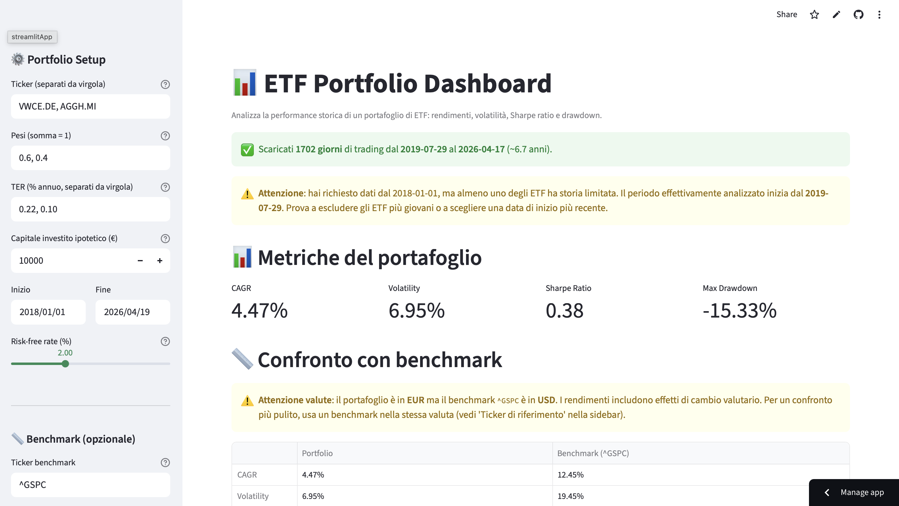
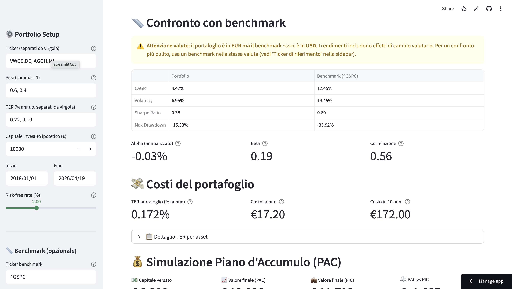
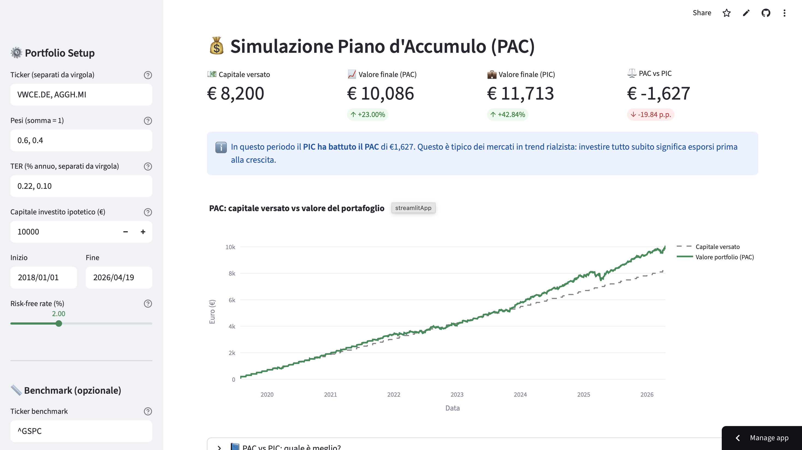
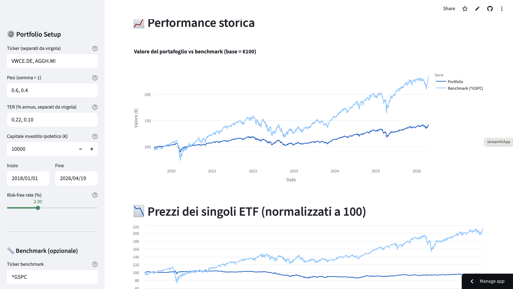

# 📊 ETF Portfolio Dashboard

An interactive Streamlit web application to analyze historical performance of multi-asset ETF portfolios. Built as a portfolio project to demonstrate quantitative finance concepts and Python full-stack development.

**🌐 [Live Demo](https://giacomo-etf-dashboard.streamlit.app)**

---

## ✨ Features

### Portfolio Analytics
- **Core metrics**: CAGR, annualized volatility, Sharpe ratio, max drawdown
- **Customizable time period** and risk-free rate
- **Rebalancing strategies**: buy & hold vs periodic rebalancing (daily, monthly, quarterly, yearly, or every N periods)
- **Multi-asset support** with user-defined weights

### Benchmark Comparison (CAPM)
- Side-by-side comparison with any market index or ETF
- **Alpha** (annualized, risk-adjusted excess return)
- **Beta** (systemic risk exposure)
- **Correlation** between portfolio and benchmark
- **Currency-awareness**: automatic warnings when portfolio and benchmark are in different currencies, avoiding misleading comparisons from FX effects

### Cost Analysis
- Weighted **TER** (Total Expense Ratio) computation
- Annual cost in euros on hypothetical investment
- 10-year projected cost for long-term impact visualization

### PAC / Dollar-Cost Averaging Simulation
- Simulate monthly contributions over time
- **PAC vs PIC** (lump sum) comparison with identical total capital
- Contextual explanation of which strategy won and why
- Interactive chart overlaying capital contributed vs portfolio value

### Visualizations
- Normalized performance chart (portfolio vs benchmark, base 100)
- Individual ETF price curves
- Correlation heatmap across assets
- Full price table

### Reference Data
- Curated list of **15+ UCITS ETFs** for European investors (Vanguard, iShares, SPDR, Amundi, Xtrackers)
- **14+ market indices** (S&P 500, Euro Stoxx 50, Nikkei, MSCI World, etc.)
- Displayed as reference tables inside the sidebar for quick ticker lookup

---

## 🛠️ Tech Stack

- **Python 3.11+**
- **Streamlit** — Web UI framework
- **pandas, numpy** — Data manipulation and numerics
- **yfinance** — Historical price data (Yahoo Finance)
- **plotly** — Interactive charts
- **Deployed on Streamlit Community Cloud**

---

## 📁 Project Structure

\`\`\`
etf-portfolio-dashboard/
├── src/
│   ├── data_loader.py       # yfinance download with multi-exchange data alignment
│   ├── metrics.py           # CAGR, volatility, Sharpe, drawdown, alpha/beta (CAPM)
│   ├── portfolio.py         # Portfolio construction, rebalancing, TER, DCA simulation
│   └── reference_data.py    # Curated ETF/index lists + currency detection
├── .streamlit/
│   └── config.toml          # Custom theme configuration
├── docs/screenshots/        # Dashboard screenshots for documentation
├── app.py                   # Streamlit entry point
├── requirements.txt
└── README.md
\`\`\`

---

## 🚀 Getting Started (Local)

**Requirements**: Python 3.11+, pip

\`\`\`bash
# Clone the repository
git clone https://github.com/giacomomignuzzi/etf-portfolio-dashboard.git
cd etf-portfolio-dashboard

# Create and activate a virtual environment
python3 -m venv venv
source venv/bin/activate   # On Windows: venv\\Scripts\\activate

# Install dependencies
pip install -r requirements.txt

# Run the app
streamlit run app.py
\`\`\`

The app will open automatically in your browser at `http://localhost:8501`.

---

## 🧠 Key Design Decisions

**Multi-exchange data alignment**: When combining ETFs from different exchanges (e.g. Xetra and Borsa Italiana), trading calendars differ. The app uses `dropna(how="any")` when aligning prices to avoid misleading portfolio values on mismatched dates — a subtle but common bug in retail portfolio tools.

**Currency-awareness**: The app detects quotation currencies from Yahoo Finance ticker suffixes (.DE, .MI, .L, .T, etc.) and warns users when their portfolio mixes currencies or when the benchmark is in a different currency than the portfolio. This prevents the common pitfall of attributing FX-driven returns to asset performance.

**Rebalancing flexibility**: Beyond standard frequencies (daily/monthly/quarterly/yearly), users can specify "every N periods" (e.g. rebalance every 2 quarters) for realistic simulation of institutional strategies.

**PAC as a first-class feature**: Most retail tools show only lump-sum returns. Since ~90% of European retail investors actually invest monthly from salary, the dashboard includes full DCA simulation with comparison to lump-sum — an honest reflection of how real money gets invested.

---

## 📚 About

Built by [Giacomo Mignuzzi](https://github.com/giacomomignuzzi) as a hands-on exercise in applied quantitative finance and Python development.

**Disclaimer**: This tool is for educational purposes only. It is not financial advice. Historical performance does not guarantee future results.